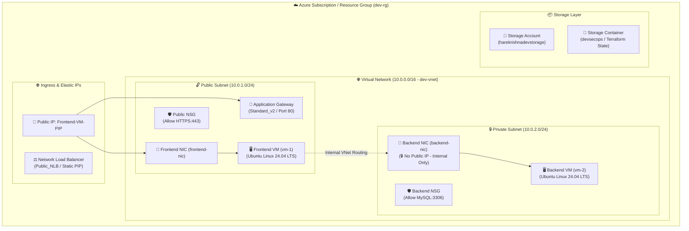

# 🚀 Enterprise Azure Infrastructure Landing Zone with Modular Terraform & Azure DevOps

[](https://www.terraform.io/)
[](https://azure.microsoft.com/)
[](https://azure.microsoft.com/en-us/products/devops/)
[](https://github.com/hashicorp/hcl)
[](LICENSE)
[](#-architecture--design-patterns)

An enterprise-grade, highly scalable, and fully modular **Infrastructure-as-Code (IaC)** solution designed to provision multi-tier cloud landing zones on **Microsoft Azure**. 

Built following industry best practices, this repository leverages reusable HCL modules driven by dynamic data structures (`for_each` maps), strict network isolation, zero-public-IP backend security patterns, and seamless environment lifecycle management (`Dev` / `Prod`).

---

## 📋 Table of Contents

- [✨ Key Architecture Highlights](#-key-architecture-highlights)
- [🏛️ System Architecture](#️-system-architecture)
- [📁 Repository Structure](#-repository-structure)
- [🧩 Modular Infrastructure Components](#-modular-infrastructure-components)
- [⚡ Getting Started](#-getting-started)
  - [Prerequisites](#prerequisites)
  - [Local Deployment Walkthrough](#local-deployment-walkthrough)
- [♾️ Azure DevOps CI/CD Automation](#️-azure-devops-cicd-automation)
- [🛡️ Security & Enterprise Best Practices](#️-security--enterprise-best-practices)
- [📜 License](#-license)
- [👤 Author & Portfolio](#-author--portfolio)

---

## ✨ Key Architecture Highlights

* **100% DRY & Map-Driven Architecture**: All infrastructure resources are instantiated using highly dynamic parameter maps (`rgs`, `vnets`, `subnets`, `vms`, `app_gateways`, `nsgs`, etc.), ensuring zero code duplication across environments.
* **Multi-Tier Network Segregation**: Implements public and private subnet topologies (`10.0.1.0/24` Public Subnet, `10.0.2.0/24` Private Subnet) within a dedicated Virtual Network (`dev-vnet`).
* **Zero-Public-IP Backend Isolation**: Backend VM (`Backend-VM`) resides strictly in the private subnet without any Public IP allocation, mitigating direct internet exposure and enforcing zero-trust ingress control.
* **Granular Network Security (NSGs)**: Micro-segmented firewalls restricting ingress traffic to authorized ports (`HTTPS:443` for Frontend VM, `MySQL:3306` for Backend database layer).
* **Layer-7 Application Delivery**: Azure Application Gateway (`Standard_v2`) configured with HTTP listeners, custom backend pools, routing rules, and dynamic health probes.
* **Layer-4 High Availability**: Network Load Balancer (`Public_NLB`) for high-throughput TCP/UDP traffic distribution.
* **Scalable Compute Engine**: Automated Ubuntu Linux VM provisioning (`Canonical ubuntu-24_04-lts`) with managed OS disks, customized tagging (`Backup = "Daily"`), and dynamic NIC attachments.
* **Remote State & Storage Layer**: Dedicated Azure Storage Account (`harekrishnadevstorage`) and Blob Container (`devsecops`) management for state locking and persistent artifact storage.
* **Environment Isolation**: Dedicated environment directory structures (`Env/Dev`, `Env/Prod`) allowing clean staging, variable management, and blast-radius mitigation.

---

## 🏛️ System Architecture



---

## 📁 Repository Structure

```text
terraform-azure-devops/
├── Env/                                    # Environment Orchestration Layer
│   ├── Dev/                                # Development Environment
│   │   ├── main.tf                         # Module invocations & dependency ordering
│   │   ├── provider.tf                     # AzureRM Provider specification (v4.81.0)
│   │   ├── variable.tf                     # Input variable declarations
│   │   └── terraform.tfvars                # Infrastructure parameters & map definitions
│   └── Prod/                               # Production Environment
│       ├── main.tf                         # Production orchestration entrypoint
│       ├── provider.tf                     # Provider settings for Prod
│       ├── variable.tf                     # Variable definitions for Prod
│       └── terraform.tfvars                # Production environment configuration
├── Modules/                                # Reusable Core Terraform Modules (DRY Design)
│   ├── azurerm_application_gateway/        # Layer-7 App Gateway v2 ALB/WAF module
│   ├── azurerm_bastion/                    # Secure Bastion Host access module
│   ├── azurerm_key_vault/                  # Secrets & Certificate management module
│   ├── azurerm_linux_virtual_machine/      # Compute instance module (Ubuntu 24.04 LTS)
│   ├── azurerm_load_balancer/              # Layer-4 Network Load Balancer module
│   ├── azurerm_network_interface/          # Network Interface Card (NIC) module
│   ├── azurerm_network_security_group/     # Firewalls & Security Rules module
│   ├── azurerm_public_ip/                  # Public IP (Static/Dynamic) module
│   ├── azurerm_resource_group/             # Azure Resource Group provisioning module
│   ├── azurerm_storage_account/            # Storage Account management module
│   ├── azurerm_storage_container/          # Storage Container / Blob module
│   ├── azurerm_subnet/                     # Subnet configuration module
│   └── azurerm_virtual_network/            # Virtual Network (VNet) core module
├── .gitignore                              # Git exclusion rules for secrets & tfstate
├── LICENSE                                 # Open-source MIT License
└── README.md                               # Project documentation
```

---

## 🧩 Modular Infrastructure Components

| Module Name | Path | Description | Key Features / Inputs |
| :--- | :--- | :--- | :--- |
| **Resource Group** | [`Modules/azurerm_resource_group`](file:///d:/Study/Git/azure-repo/terraform-azure-devops/Modules/azurerm_resource_group) | Lifecycle container for Azure resources | Location (`eastus`), Tags, Dynamic `for_each` creation |
| **Virtual Network** | [`Modules/azurerm_virtual_network`](file:///d:/Study/Git/azure-repo/terraform-azure-devops/Modules/azurerm_virtual_network) | Core network spine | Address space (`10.0.0.0/16`), VNet scoping |
| **Subnets** | [`Modules/azurerm_subnet`](file:///d:/Study/Git/azure-repo/terraform-azure-devops/Modules/azurerm_subnet) | Subnet partitioning (Public/Private) | `public-subnet` (`10.0.1.0/24`), `private-subnet` (`10.0.2.0/24`) |
| **Public IP** | [`Modules/azurerm_public_ip`](file:///d:/Study/Git/azure-repo/terraform-azure-devops/Modules/azurerm_public_ip) | External connectivity endpoints | Static allocation (`Frontend-VM-PIP`, `PublicIPForLB`) |
| **Network Interfaces** | [`Modules/azurerm_network_interface`](file:///d:/Study/Git/azure-repo/terraform-azure-devops/Modules/azurerm_network_interface) | VM Network attachment interfaces | `frontend-nic` (Public PIP bound), `backend-nic` (Private VNet bound) |
| **Network Security Groups** | [`Modules/azurerm_network_security_group`](file:///d:/Study/Git/azure-repo/terraform-azure-devops/Modules/azurerm_network_security_group) | Stateful packet filtering firewalls | `Public-VM-NSG` (Allow HTTPS:443), `Backend-VM-NSG` (Allow MySQL:3306) |
| **Application Gateway** | [`Modules/azurerm_application_gateway`](file:///d:/Study/Git/azure-repo/terraform-azure-devops/Modules/azurerm_application_gateway) | Layer-7 Web Traffic Load Balancer | `Standard_v2` SKU, HTTP Listener (Port 80), Backend Pools |
| **Load Balancer** | [`Modules/azurerm_load_balancer`](file:///d:/Study/Git/azure-repo/terraform-azure-devops/Modules/azurerm_load_balancer) | Layer-4 Traffic distribution | `Public_NLB`, Static Public IP frontend |
| **Linux Virtual Machines** | [`Modules/azurerm_linux_virtual_machine`](file:///d:/Study/Git/azure-repo/terraform-azure-devops/Modules/azurerm_linux_virtual_machine) | Compute instances (`Frontend-VM`, `Backend-VM`) | Canonical Ubuntu 24.04 LTS (`Standard_D4_v5`), Daily Backup tags |
| **Storage Account & Container** | [`Modules/azurerm_storage_account`](file:///d:/Study/Git/azure-repo/terraform-azure-devops/Modules/azurerm_storage_account) | Cloud object storage & remote state backend | `harekrishnadevstorage` (LRS Standard), `devsecops` Private Container |
| **Key Vault** | [`Modules/azurerm_key_vault`](file:///d:/Study/Git/azure-repo/terraform-azure-devops/Modules/azurerm_key_vault) | Secrets & credentials governance | Hardware Security Secrets, Certificate access policies |
| **Bastion Host** | [`Modules/azurerm_bastion`](file:///d:/Study/Git/azure-repo/terraform-azure-devops/Modules/azurerm_bastion) | Secure RDP/SSH jump box management | Zero public IP exposure management for VMs |

---

## ⚡ Getting Started

### Prerequisites

Ensure you have the following installed on your workstation:
* [Terraform CLI](https://developer.hashicorp.com/terraform/downloads) (v1.5.0+)
* [Azure CLI](https://learn.microsoft.com/en-us/cli/azure/install-azure-cli) (v2.50.0+)
* An active **Microsoft Azure Subscription** with Owner/Contributor privileges.

### Local Deployment Walkthrough

1. **Clone the Repository**
   ```bash
   git clone https://github.com/vikashkumardevops/terraform-azure-devops.git
   cd terraform-azure-devops
   ```

2. **Authenticate with Azure**
   ```bash
   az login
   az account set --subscription "<YOUR_AZURE_SUBSCRIPTION_ID>"
   ```

3. **Initialize & Deploy Development Infrastructure**
   ```bash
   # Navigate to the Dev environment
   cd Env/Dev

   # Initialize Terraform modules & backend
   terraform init

   # Format & Validate configuration
   terraform fmt
   terraform validate

   # Preview infrastructure execution plan
   terraform plan -out=dev.tfplan

   # Apply plan to provision resources
   terraform apply dev.tfplan
   ```

4. **Tear Down / Destroy Infrastructure**
   ```bash
   terraform destroy -auto-approve
   ```

---

## ♾️ Azure DevOps CI/CD Automation

This workspace is structured for automated execution within **Azure DevOps Pipelines**. Below is an enterprise YAML pipeline blueprint for automated Plan & Apply stages:

```yaml
trigger:
  branches:
    include:
      - main
  paths:
    include:
      - Env/Dev/**
      - Modules/**

pool:
  vmImage: 'ubuntu-latest'

variables:
  azureServiceConnection: 'Azure-DevOps-Service-Principal'
  workingDir: '$(System.DefaultWorkingDirectory)/Env/Dev'

stages:
- stage: ValidateAndPlan
  displayName: 'Terraform Lint, Validate & Plan'
  jobs:
  - job: Plan
    steps:
    - task: TerraformInstaller@1
      inputs:
        terraformVersion: 'latest'

    - task: AzureCLI@2
      displayName: 'Terraform Init & Plan'
      inputs:
        azureSubscription: '$(azureServiceConnection)'
        scriptType: 'bash'
        scriptLocation: 'inlineScript'
        inlineScript: |
          cd $(workingDir)
          terraform init
          terraform validate
          terraform plan -out=$(Build.ArtifactStagingDirectory)/tfplan

    - task: PublishBuildArtifacts@1
      inputs:
        PathtoPublish: '$(Build.ArtifactStagingDirectory)/tfplan'
        ArtifactName: 'tfplan'

- stage: DeployProd
  displayName: 'Terraform Apply (Approval Required)'
  dependsOn: ValidateAndPlan
  condition: succeeded()
  jobs:
  - deployment: Apply
    environment: 'Production-Approval-Gate'
    strategy:
      runOnce:
        deploy:
          steps:
          - task: AzureCLI@2
            displayName: 'Terraform Apply'
            inputs:
              azureSubscription: '$(azureServiceConnection)'
              scriptType: 'bash'
              scriptLocation: 'inlineScript'
              inlineScript: |
                cd $(workingDir)
                terraform init
                terraform apply -auto-approve $(Pipeline.Workspace)/tfplan/tfplan
```

---

## 🛡️ Security & Enterprise Best Practices

* **Zero-Public-IP Backend Subnet**: Backend instances (`Backend-VM`) are configured without public IP addresses, enforcing pure internal VNet routing and preventing unauthorized external access.
* **Least Privilege Access Control**: Resource provisioning utilizes isolated Azure Service Principals with RBAC restrictions.
* **Granular Firewalls**: Network Security Groups explicitly limit inbound connections to necessary service ports (`443` for Web, `3306` for Database).
* **Secrets Governance**: Sensitive credentials (e.g., VM passwords) are injected dynamically via environment variables or Azure Key Vault rather than stored in plain text.
* **Comprehensive Tagging Policy**: All provisioned resources carry enterprise metadata tags (`Environment`, `Created By`, `OS`, `Backup`, `Owner`) for cost governance and policy auditing.
* **State Encryption**: Remote state files are protected at rest with 256-bit AES encryption inside Azure Blob Storage containers.

---

## 📜 License

Distributed under the MIT License. See [`LICENSE`](file:///d:/Study/Git/azure-repo/terraform-azure-devops/LICENSE) for more information.

---

## 👤 Author & Portfolio

**Vikash Kumar**  
*DevOps & Cloud Infrastructure Engineer*

- 🌐 **GitHub**: [@vikashkumardevops](https://github.com/vikashkumardevops)
- 💼 **LinkedIn**: [Vikash Kumar](https://www.linkedin.com/in/vikashkumar0505/)
- 📧 **Email**: [iamvikashkumar05@gmail.com](mailto:iamvikashkumar05@gmail.com)
- 📂 **Repository**: [terraform-azure-devops](https://github.com/vikashkumardevops/terraform-azure-devops)

---

<p align="center">
  <i>⭐ If you found this repository helpful, please consider giving it a star! ⭐</i>
</p>
